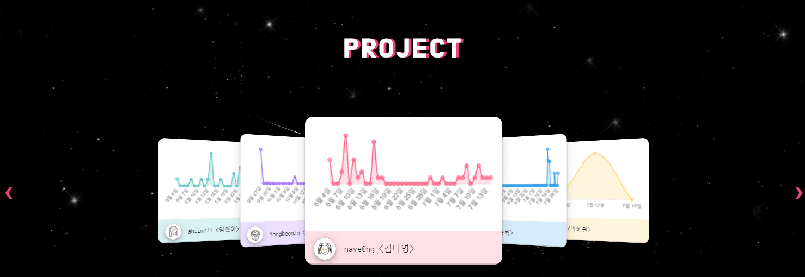
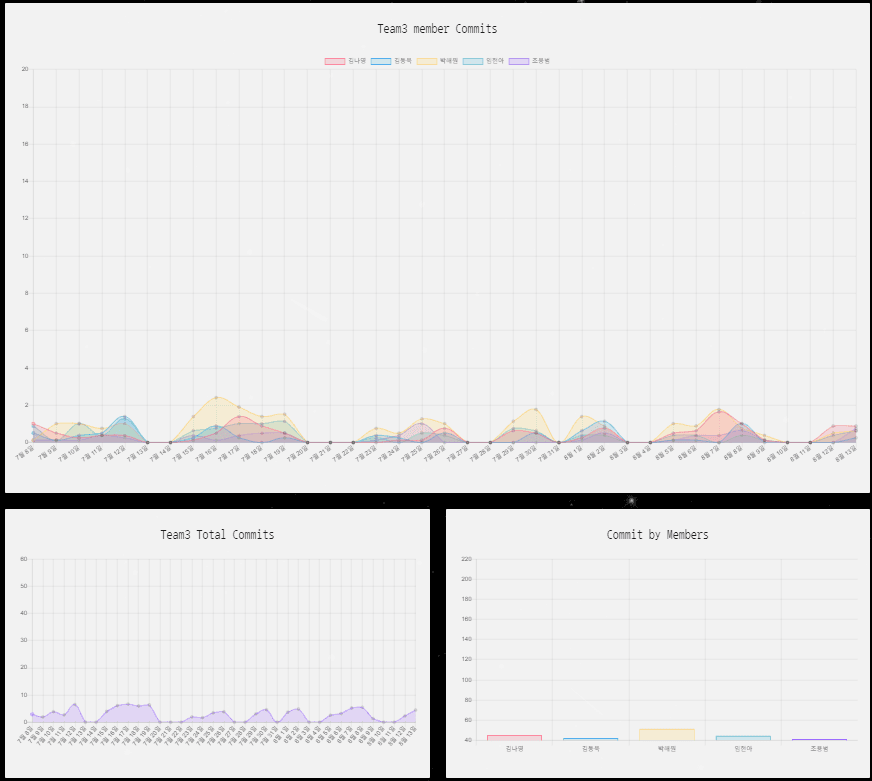
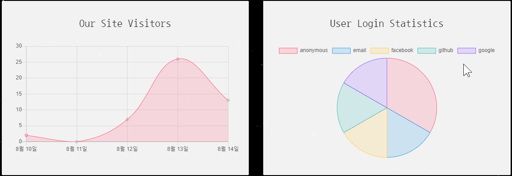
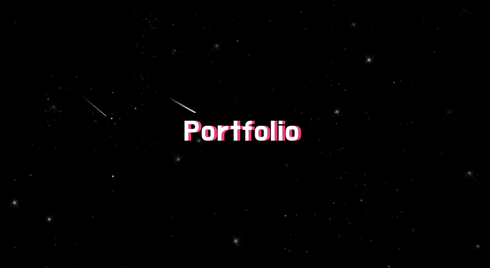

# Hello Universe : 김나영( :hotsprings::o:)

 안녕하세요. 웹 프론트와 서버 모두에 관심있는 주니어 개발자 김나영( :hotsprings::o:)입니다.


## 1차 개발일지

**기간 : 2019.07.08 ~ 2019.07.19**

<br/>

 #### 1. git repository commit 그래프 구현

- A. 팀원 대표 repository 그래프

  

  - github api와 chart.js를 이용한 그래프 구현

  - 3d Carousel로 UI 구성
  
	  ```javascript
    // function : createCommitData(data, today)
  	let end = new Date(data[0].commit.author.date.slice(0, 10));
    let start = new Date(data[data.length - 1].commit.author.date.slice(0, 10));
    let labels = [];
    let commits = [];
    let k = data.length - 1;
    // 첫날과 마지막 날을 기준으로 data에서 commit을 추출한다.
    while (start <= end) {
        labels.push(start.getMonth() + 1 + "월 " + start.getDate() + "일");
        commits.push(0);
        while (k >= 0) {
        var dt = new Date(data[k].commit.author.date.slice(0, 10));
        if (dt - start == 0) {
            commits[commits.length - 1] += 1;
            k -= 1;
        } else {
            break;
        }
        }
        start.setDate(start.getDate() + 1);
    }
    ```
    
  
- B. 팀 repository 멤버별 commit 그래프

     
     
     - github api는 한 번 호출 시 최대 100개의 commit을 가져오며, 나머지 commit에 대한 url을 header에서 넘긴다.
     
     - async 재귀함수로 모든 커밋을 받아오도록 구성
     
       ````javascript
       async getTeamCommits(API_URL, data, today) {
           var response = await axios.get(API_URL);
           data = data.concat(response.data);
           var header = response.headers.link.split(", ")[0];
           header = header.split("; ");
           var nextUrl = header[0].slice(1, -1);
           var isNext = header[1] === 'rel="next"' ? true : false;
           if (isNext) {
               // 다음 호출이 필요한 경우(isNext === true) 재귀적으로 getCommits함수를 호출한다.
               await this.getTeamCommits(nextUrl, data, today)
           } 
           else {
       		// Call commit data parsing function and drawing graph function
           }
       },
       ````

<br/>

#### 2. 웹 로그 수집 및 통계



- HomePage.vue에서 pushWebLog() 로그수집 함수를 호출

  - web browser storage를 사용하여 새로고침 시 중복 수집 방지

- 동일한 사용자의 중복 로그 수집을 막기 위해 web browser storage를 사용
  - vuex state를 스토리지 값으로 초기화, 사용자 트래킹 가능
  
  - 사용자 로그인 시, 이전 로그의 user에 사용자 추가(중복 로그 수집 방지)
  
    ```json
    // 로그인 전
    "Fri Aug 02 2019" : {
      "-LlET9vLTQqd0zBu82Y9" : {
        "date_time" : "Fri Aug 02 2019 08:16:44 GMT+0900 (한국 표준시)",
        "user" : ""
      },
      ...  
    }
    ```
  
    ```json
    // 로그인 후
    "Fri Aug 02 2019" : {
      "-LlET9vLTQqd0zBu82Y9" : {
        "date_time" : "Fri Aug 02 2019 08:16:44 GMT+0900 (한국 표준시)",
        "user" : "test123@naver.com"
      },
      ...  
    }
    ```

<br/>

#### 3. 이미지 배너(반짝이는 별, 별똥별)



- [참고](https://codepen.io/WebSonick/pen/vjmgu)하여 구현

<br/>

## 2차 

**기간 : 2019.07.22 ~ 2019.08.16**

<br/>

#### 1. 웹 사이트 회원 권한 구분


- 소셜 아이디로 로그인하는 경우 firebase auth를 사용하므로 firebase realtime database에는 정보가 존재하지 않음
  - user의 정보가 firebase authentication(소셜)과 firebase realtime database(회원가입)으로 나눠 저장되기에 회원 권한을 구분할 때 문제가 발생한다. 

- 이를 해결하기 위해 유저가 소셜계정으로 로그인을 할 경우, realtime database에 회원가입과 동일한 정보를 푸시하도록 함.

<br/>

#### 2. 관리자 페이지 구현 : accessLevel CRUD

- google analytics 와 data studio를 연동하여 iframe으로 띄워줌
- `v-bind:class`를 이용한 토글 버튼 제어
- firebase realtime database 의 user 데이터의 CRUD 구현

<br/>

#### 3. 오프라인 데이터베이스 : 오프라인 접속

- firebase에서 제공하는 offline database 기능 설정
- firebase storage data의 경우 offline을 위해 캐싱되지 않음
  - firestore database에 이미지를 변환(dataurl type)하여 저장 [이미지 변환 - 조용범](./조용범.md) 
- [firebase offline document](https://firebase.google.com/docs/firestore/manage-data/enable-offline?hl=ko#get_offline_data)

<br/>


#### 4. 인트로 페이지(애니메이션)


<br/>

#### 5. 로딩 애니메이션


- 로딩은 전체화면을 `position:related`로 잡아 `position:absolute`로 화면의 정중앙에 내용을 뿌려줘야한다.  그러나 로딩을 필요로 하는 몇몇 페이지의 background는 position이 related가  아닌 absolute 혹은 fixed로 고정되어 있어 이를 변경할 경우 기존의 UI가 무너지는 문제가 발생한다.

- 이는 class를 동적으로 바인딩하여 해결할 수 있었다.

  - .toggle-position이 this.$store.state.isLoading의 값에 따라 토글되는 class다.

  ```vue
  <v-layout :class="{'toggle-posiiton':this.$store.state.isLoading}">
  	<!-- 로딩완료시 보여짐 -->  
      <v-container v-show="!this.$store.state.isLoading"></v-container>
      <!-- 로딩화면 -->
      <SolarSystemLoading v-show="this.$store.state.isLoading"></SolarSystemLoading>
  </v-layout>
  ```

  

<br/>

#### 6. 관리자 페이지 기능 추가(사용자 권한 요청 알림)

- firebase에서 제공하는 `on()`함수는, 일정 시간마다 database의 값을 불러오므로 알림 요청을 실시간으로 받아올 수 있다.

<br/>

#### 7. github api 호출 횟수 제한 해결

- 페이지 로딩시 github api의 호출로 인한 `HTTP 403: Forbidden with the message API Rate Limit Exceeded` 발생

- firebase database와 연동하여 하루 한 번만 github api를 호출 하도록 함

  ```javascript
  initCommitData(){
      var today = new Date().toString().slice(0,15)
      firebase.database().ref().child("commits").child(today).child('team3').on("value", snapshot => {
          var commits = snapshot.val();
          if(commits == null && this.visited == false){
              this.visited = true
              this.getTeamCommits("API_URL", [],today)	// github api 호출 함수
          }
          else if(this.visited == false) {
              this.visited = true
              // commits를 이용한 그래프 그리기
          }
      })  
  },
  ```
  
- firebase에서 제공하는 `on()`함수는, 일정 시간마다 database의 값을 불러온다. 그래서 내부에서 호출하는 비동기함수  `getTeamCommits()`가 끝나지 않아도 계속해서 새로운 호출이 반복되고, 같은 차트가 다시 그려지는 문제가 있었다.

-  이를 해결하기 위해 visited 변수로 함수의 호출여부를 true, false로 제어하여 반복되는 호출을 막았다.

<br/>